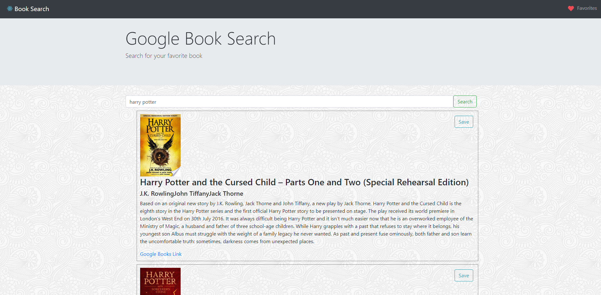
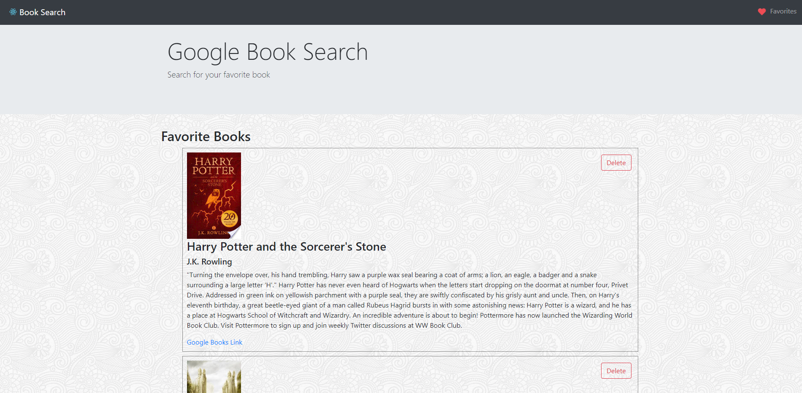

# NYT-Google-Search
## Overview 
This is a full stack MERN app that allows you to ping Google Book API and search for a book. The app will display a maximun of ten results of the search to the user. The results will display the title, author(s), image, description, a link to google books, and a save button that will save that book to favorites. Click the favorites tab in the upper right corner, and it will lead you to the favorites page. The favorites page will display all the books that are saved to favorites in the same format the results from the search are display except instead a save to favorites button, it will display a delete button that will remove the book from favorites. Happy searching!



## Getting started

* **IF** your cloning or forking this repo, to get started follow a few steps. 
- This app uses MongoDB, so you will want to make sure that is downloaded first.
- Install the packages in the root folder
``` npm i ```
- Change directories into client and install
``` cd client ```
``` npm i ```
- You can now connect your mongo server by opening a new ternimal and typing into the console: ```mongod```
- Now open another terminal and type: ```mongo``` . You are now connected to the mongoDB. 
- ```npm start``` and your good to go. 

## Tech Approach
### Began by creating the server, controller, routes, and models.

- Server 

In server.js require express, mongoose, and the routes folder. Create a const app that is equal to the express function and create a PORT equal to process.env.PORT ( for heroku ) or port 3001.

Create your boilerplate for express which is using urlencoded extending to true, express.json(), and routes.

Connect to mongoDB. Create a variable MONGODB_URI and have it equal to process.env.MONGODB_URI or your localhost. This step is for connecting to mLab when deploying to heroku. Then have mongoose connect to the MONGODB_URI and pass useNewUrlParser equal to true. Start your server by creating a function that listen for the port.

- Controller

Create the functions that tell our database what to do. In this folder create a function findAll, findById, create, update, and remove. These functions access the db collection of books and then does their request. The call will respond with JSON and catch any error and respond with a status code 422.

- Routes

The routes folder uses express.Router and detects for any api calls; if no api calls, then router uses the blient build index for react. There are two API routes: "api/books" and "api/books/:id". 

The route "api/books" will either get all the books requested by calling the function written in the controllers using the findAll method or will post a book by calling the function in controller using a create method.

The route "/api/books/:id" is used to either findById of the book requested or remove that book from the DB. This calls a function in the controller that uses the method remove. This is used when the user decides to delete a book from the favorites list.

- Models

Basic Schema that creates a document in the MongoDB. This Schema creates fields title, authors, description, image, link, and date. These fields are filled with the data we get back from our API call to the Google Books API. 

### Now move onto the client folder to build the app

In the src folder create three folders: components, pages, and utils. Components holds all of our components, pages contains our two pages: home ( where you search for books) and favorites, and the utils folder will have our axios calls pinging the Google Books API and calling the routes in our routes folder. 

- Components

To build a basic structure, create a navbar, jumbotron, searchbar, wrapper, and footer. These are all stateless components and you can primarily drag and drop some bootstrap into here and rename classes to className and close off any self-closing tags. 

The two other components are BookList and FavortiesList which will be used to create the results from the data by using the .map function to iterate over the state of either books or favorites and displayed to the dom. 

```javascript
             {Object.keys(this.state.books).map( key => <BookList
             key={key}
             index={key}
             details={this.state.books[key]}
             addToFavorites={this.addToFavorites}
             />)}
```

Each of these components take in the data from the .map function by way of props and then use es6 destructuring to render each piece of data to their specific tag in the list. 

```javascript
                <li className="bookList">
                    <button className="saveBook btn btn-outline-info" 
                    onClick={this.handleClick}> Save </button>
                    
                    <h3 className="bookTitle">{title}</h3>
                    <h5 className="bookAuthor">{authors}</h5>
                    <p>{description}</p>
                    <a className="bookLink" href={infoLink}>Google Books Link</a>
                </li>
```

- Pages

There are two pages: Home and Favorites. Both of these pages are statefull components. The home page has the state of the search, which is an empty array, and books, which is an empty object.

There are three functions in the home page which are searchBooks, handleInputChange, and handleSubmitForm. The searchBooks function passes the argument query and then use arrow function and call the API function created in the utils folder for the API call to Google Books. This function response with the books data that will be set to the state of books.

```javascript
  searchBooks = query => {
    API.bookSearch(query)
    .then(res => this.setState({ books: res.data.items}))
    .catch(err => console.log(err));
  }
```
The handleInputChange passes an event then take the value of the event.target.value and also gets the name of the event.target. name . With those input setState to the [name]: value . The [name] will be search and the value will be whatever was typed into the search bar. This gets set to state so we can call it in the next function.

HandleFormSubmit preventsDefault form submission so the page does not automatically refresh and then calls the searchBook function passing the the state of the search. 

For the render() { return ( ... )} Inside the return div is the navbar, jumbotron, wrapper, and searchbar components. After the search bar is an unordered list and inside the unordered list is where we use the map function to map over the Booklist component displayed earlier. 

The favorites page is a statefull component. The state is favorites which is an empty object. This page has a lifecycle componentWillMount() which calls the API function in the utils folder getSavedBooks. Whenever the 'save' button is clicked on the home page, that book's data gets put into the DB. Get all the savedBooks from the DB and set them to state. Just like for Booklist, use map function to iterate over the state of favorites to display the favorite books. In order to delete a book from the favorites list, create a function deleteBook that passes in the id and runs the API call from the utils folder deleteSavedBook and pass in the id. With the reponse, run the function loadFavorites. Now with a book deleted from the DB, LoadFavorites calls the API.getSavedBooks and sets the response to state. Now with the state changed the DOM will render the new state which will have one less book in the favorites.

Finally, in our App component we set up our React-router. This will render each page depending on the endpoint hit. This component imports to the index file, which is then rendered by ReactDOM.render to the id 'root' in the html file in public. Now we are cooking with gasoline!

## Tech Stack

- HTML, CSS, JS, Bootstrap
- React, React-Router, Axios
- Node, Express, MongoDB

## Link

https://booksearchwithgoogle.herokuapp.com/